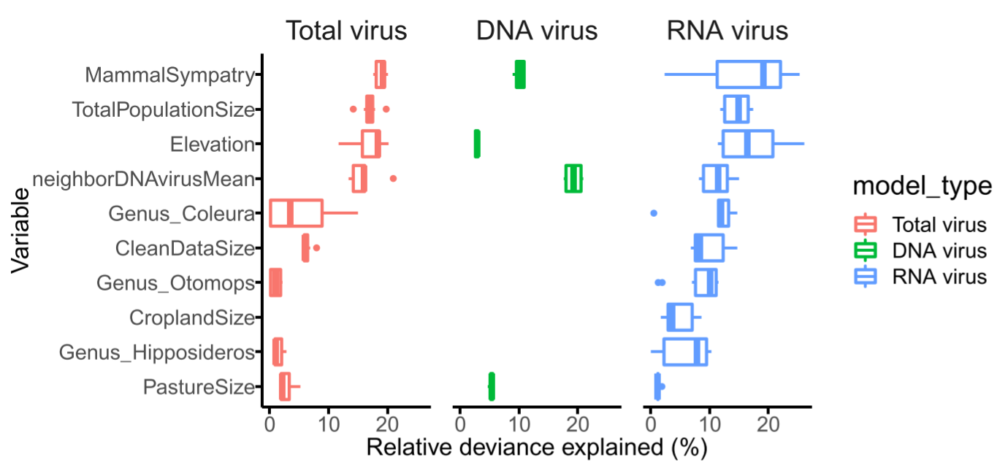
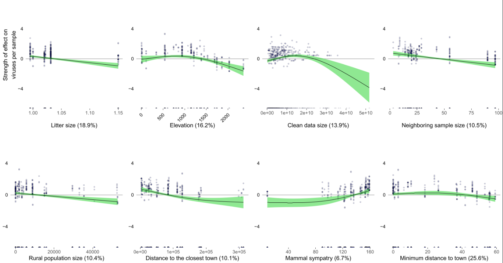

[](https://gitlab.genomics.cn/iori/gvd/virome-identification)

# Table of Contents
- [Table of Contents](#table-of-contents)
- [Auto GAM](#auto-gam)
- [Base Structure](#base-structure)
- [Usage](#usage)
  - [Prepare](#prepare)
  - [Input](#input)
  - [Fit GAM on Windows (deprecated in current version)](#fit-gam-on-windows-deprecated-in-current-version)
  - [Fit GAM On Linux](#fit-gam-on-linux)
  - [Output](#output)
  - [Plot](#plot)
- [Ecology Data Collection](#ecology-data-collection)
- [Maintainers](#maintainers)
- [Contributors](#contributors)
- [License](#license)
- [Citation](#citation)

# Auto GAM

This repository contains all the code used for ecological analysis in the East African Bat Virome Project.  Using ecological datasets from the bat host (genus based) and environment (GPS based) to build the generalized additive models (GAM) to fit the amount of DNA/RNA/all virus species detected in each sample automatically.

**Generalized Additive Model (GAM)** is a [generalized linear model](https://en.wikipedia.org/wiki/Generalized_linear_model "Generalized linear model") in which the linear response variable depends linearly on unknown [smooth functions](https://en.wikipedia.org/wiki/Smooth_function "Smooth function") of some predictor variables, and interest focuses on inference about these smooth functions. [reference](https://en.wikipedia.org/wiki/Generalized_additive_model)

In 2017,  Kevin J. Olival et al. published a paper on Nature, using GAM to detect how host and virus traits impact the virus zoonotic ability. [(Olival, Hosseini et al. 2017)](https://www.nature.com/articles/nature22975)

# Base Structure

```
.
├─AutoGAM               #main directory
│  └─src                #script directory
│      ├─data           #ecology and host data
│      ├─R              #R script
│      └─tmp            #tmp file
├─documents             #description of dataset and images
│  ├─ecology
│  ├─host
│  ├─images
│  └─method
└─example               #usage example
    ├─input
    └─output
```

# Usage

## Prepare

First using git clone to fetch the repository.

```{bash}
$ git clone ssh://git@gitlab.genomics.cn:2200/iori/gvd/gm.git
```

All R packages with version are exported as `autogam_env.yml`, it can also installed by conda or mamba.

```{bash}
$ mamba env create -n autoGAM --file AutoGAM/autogam_env.yml
```

If you need to add some new virus (previously detected but haven’t consider in GAM before) in GAM, only need to provide the `Cname` list (one `Cname` one line, example: `example/input/COOSP_virus_Cname.txt`) as the input of `addSomeVirus` function and give a name of this virus set.

```{R}
addSomeVirus(path_virus = P("example/input/COOSP_virus_Cname.txt"),
             virus_type = "COOSP") #this function is in AutoGAM/src/R/Utils.R
```

## Input


There are two Excel table (.xlsx) as input files, the first one must contain `sample` column in order to provide a set of samples considered in analyzed, the example is `example/input/batfeces_positive_0724_rerun_v3_filtered.xlsx`

|sample|...|
|--|--|
|BAT501|...|
|BAT512|...|
|BAT1048|...|
|...|...|

The second one must include `sample, vsname, vtype` column in order to provide the number of each types of viruses detected in each sample, the example is `example/input/EastAfrica_Requantification_0724_rerun_v1_batfecesfiltedspecies_filtered.xlsx`

|sample|vsname|vtype|...|
|--|--|--|--|
|BAT501|AstV-11A|RNA|...|
|BAT512|PicoV-4A|RNA|...|
|BAT1048|ReoV-3A|RNA|...|
|BAT0636|PV-9A|DNA|...|
|...|...|...|...|

## Fit GAM on Windows (deprecated in current version)

If you do want to fit model on Windows, you can add this code in `AutoGAM/src/Main.R` and run.

```{R}
> if(T){ # fitting pipe (PC)
+	  vars = c("virus_ALL", "virus_DNA", "virus_RNA") #specific virus type by list
+	  all_gam = mclapply(vars, fitGAM)
+	  saveRDS(all_gam, P("temp/all_GAM_path.rds"))
+	}
```

## Fit GAM On Linux

```{bash}
$ cd AutoGAM
$ ls
AutoGAM.py  autogam_env.yml  src
$ ./AutoGAM.py -i1 example/input/batfeces_positive_0724_rerun_v3_filtered.xlsx\
               -i2 example/input/EastAfrica_Requantification_0724_rerun_v1_batfecesfiltedspecies_filtered.xlsx\
                --outputdir ../example/output\
                -v DNA -v RNA -v ALL
                
>>>> Running...
>>>> trimming input data...
>>>> All GAM submitted.
```

## Output

Output structer
```{bash}
./output
└── 2022-07-28
    ├── fit_ALL.sh     #script to fit GAM
    ├── fit_DNA.sh
    ├── fit_RNA.sh
    ├── GAM_ALL.rds    #fitted model list, using .rds in order to do read by R
    ├── GAM_DNA.rds
    ├── GAM_RNA.rds
    └── GAM_submit.sh  #script to submit jobs to HPC calculate node
```

## Plot

1. After fitting GAM, using `AutoGAM/plot/GAM_*.Rmd` to calculate the total and relation deviance explained and also AIC of each model. Select a best combination of each type of model. Empirically, within 3 AIC units of the model with the lowest AIC can be accepted.

2. After get best combination of each type of model, use `AutoGAM/plot/plot_a.R` to make relation deviance explaining plot. Example: `AutoGAM/plot/plot_a.pdf`



3. Using `AutoGAM/plot/plot_b.R` to make partial residual plot of one GAM model. Example: `AutoGAM/plot/plot_b.pdf`



# Ecology Data Collection

The data is divided into two categories according to the way of obtaining: obtained from public databases or obtained from field sampling and sequencing.

The data obtained from public databases can be divided into two categories according to the query keywords: one category is the environmental characteristics queried according to the GPS of the sampling location, including geographic environment (elevation from R package elevatr)(Hollister J 2021), ecological environment (number of mammals)(International Union for Conservation of Nature - IUCN and Center for International Earth Science Information Network - CIESIN - Columbia University 2015), human Activities (population density, cropland area, grazing area, etc.)(Klein Goldewijk 2016); the other type is the host characteristics queried according to the corresponding host species of the sample, including individual host traits (weight, forearm length, litter size, feeding habits, etc.) and group Traits (group size, global habitat area, etc.).(Kate E. Jones 2009, Hamish Wilman 2014, Guy, Ratcliffe et al. 2020)

There are 4 fields in the data obtained from field sampling and sequencing. Field sampling information includes the total number of samples collected in the sampling point cluster where each sample is located and the number of species detected in other samples collected 10km around each sample; The results include the total number of bases (base) of the offline data for each sample and the total length (bp) of the assembly result of each sample.

# Maintainers

[杨凯心](https://gitlab.genomics.cn/yangkaixin1)

# Contributors

This project exists thanks to all the people who contribute

[杨凯心](https://gitlab.genomics.cn/yangkaixin1)

# License

no license available

# Citation

Olival, K., Hosseini, P., Zambrana-Torrelio, C. _et al._ Host and viral traits predict zoonotic spillover from mammals. _Nature_ **546,** 646–650 (2017). https://doi.org/10.1038/nature22975

Giampiero Marra, S. N. W. (2011). "Practical variable selection for generalized additive models." Computational Statistics and Data Analysis.

Guy, C., J. M. Ratcliffe and N. Mideo (2020). "The influence of bat ecology on viral diversity and reservoir status." Ecol Evol **10**(12): 5748-5758.

Hamish Wilman, J. B., Jennifer Simpson,Carolina de la Rosa,Marcelo M. Rivadeneira,Walter Jetz (2014). "EltonTraits 1.0: Species-level foraging attributes of the world's birds and mammals." Ecological Archives.

Hollister J, S. T., Robitaille A, Beck M, Johnson M (2021). "elevatr: Access Elevation Data from Various APIs." R package version 0.4.1.

International Union for Conservation of Nature - IUCN and Center for International Earth Science Information Network - CIESIN - Columbia University (2015). Gridded Species Distribution: Global Mammals Richness Grids, 2015 Release. Palisades, NY, NASA Socioeconomic Data and Applications Center (SEDAC).

Kate E. Jones, J. B., Marcel Cardillo,Susanne A. Fritz,Justin O'Dell,C. David L. Orme,Kamran Safi,Wes Sechrest,Elizabeth H. Boakes,Chris Carbone,Christina Connolly,Michael J. Cutts,Janine K. Foster,Richard Grenyer,Michael Habib,Christopher A. Plaster,Samantha A. Price,Elizabeth A. Rigby,Janna Rist,Amber Teacher,Olaf R. P. Bininda-Emonds,John L. Gittleman,Georgina M. Mace,Andy Purvis (2009). "PanTHERIA: a species-level database of life history, ecology, and geography of extant and recently extinct mammals."

Klein Goldewijk, K., Beusen, A., Doelman, J., and Stehfest, E. (2016). "New anthropogenic land-use estimates for the Holocene; HYDE 3.2."
